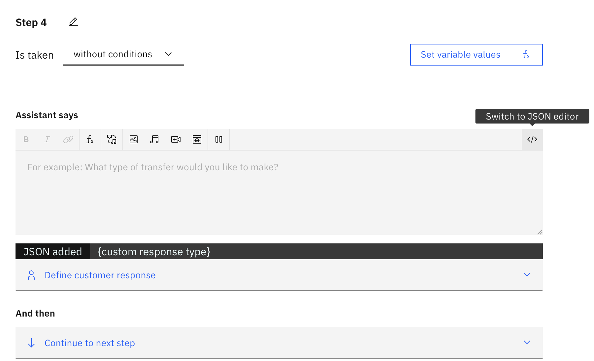

### Criar Conta IBM Cloud

- Cadastro `IBM Academic Initiative`

    [IBM Academic Initiative](https://github.com/academic-initiative/documentation/blob/main/academic-initiative/how-to/How-to-register-with-the-IBM-Academic-Initiative/readme.md)

- Obter promocode para a `IBM Cloud`

    [IBM Cloud Promocode](https://github.com/academic-initiative/documentation/blob/main/academic-initiative/how-to/How-to-request-and-IBM-Cloud-Feature-Code/readme.md)

- Ativar `IBM Cloud`

    [IBM Cloud](https://github.com/academic-initiative/documentation/blob/main/academic-initiative/how-to/How-to-create-an-IBM-Cloud-account/readme.md)

### Acesso IBM Console
- Acessar a url `https://cloud.ibm.com/`
- Obter uma chave de API `https://cloud.ibm.com/iam/apikeys`

## Text to Speech
- Utilizar como base o projeto `aula/voz`
- Criar um arquivo `.env`
```javascript
IBM_API_KEY=
IBM_URL=
PORT=3000
```
## MQ
- Instanciar o serviço de fila **IBM MQ**
- Criar um gerenciador de filas e abrir o console de gerenciamento
- Utilizar como base o projeto `aula/mq-pedidos`
- Criar um arquivo `.env`
```javascript
MQ_REST_URL=https://web-{qmgr-id}.qm.{region}.mq.appdomain.cloud/ibmmq/rest/v1

# Queue Manager name
MQ_QMGR=

# Queue name
MQ_QUEUE_NAME=

# User credentials (Basic Auth)
MQ_USER=
MQ_PASSWORD=
```
- Código para enviar um pedido para a fila MQ
```javascript
// Variáveis gerais para acesso à fila
const restUrl = process.env.MQ_REST_URL;
const qmgrName = process.env.MQ_QMGR;
const queueName = process.env.MQ_QUEUE_NAME;
const username = process.env.MQ_USER;
const password = process.env.MQ_PASSWORD;

const endpoint = `${restUrl}/messaging/qmgr/${qmgrName}/queue/${queueName}/message`;

const enviarMensagem = (message, res) => {

    // Configuração da requisição
    const config = {
        method: 'post',
        url: endpoint,
        auth: {
            username: username,
            password: password
        },
        headers: {
            'Content-Type': 'text/plain',
            'ibm-mq-rest-csrf-token': 'value' // Token CSRF obrigatório
        },
        data: message
    };

    // Enviar mensagem
    console.log('Enviando mensagem...\n');

    axios(config).then(response => {
        console.log('✓ Mensagem enviada com sucesso!');
        console.log('─────────────────────────────────────');
        console.log(`Status: ${response.status} ${response.statusText}`);
        console.log(`Conteúdo: "${message}"`);
        console.log(`Tamanho: ${message.length} bytes`);

        // Informações adicionais do response
        if (response.headers['ibm-mq-md-messageid']) {
            console.log(`Message ID: ${response.headers['ibm-mq-md-messageid']}`);
        }
        console.log('─────────────────────────────────────\n');

        res.json({
            sucesso: true,
            mensagem: "Pedido recebido com sucesso!",
            pedido: message
        });
    }).catch(error => {
        console.error('✗ Erro ao enviar mensagem:');

        if (error.response) {
            // Erro da API
            console.error(`Status: ${error.response.status}`);
            console.error(`Mensagem: ${error.response.statusText}`);

            if (error.response.data) {
                console.error('Detalhes:', error.response.data);
            }
        } else if (error.request) {
            // Erro de rede
            console.error('Erro de conexão. Verifique a URL e conectividade.');
            console.error('URL:', endpoint);
        } else {
            // Outro erro
            console.error('Erro:', error.message);
        }

        process.exit(1);
    });

}

const receberMensagem = (res) => {

    const config = {
        method: 'delete',
        url: endpoint,
        auth: {
            username: username,
            password: password
        },
        headers: {
            'ibm-mq-rest-csrf-token': 'value' // Token CSRF obrigatório
        },
        // Timeout de 30 segundos para esperar por mensagens
        timeout: 30000
    };

    console.log('Aguardando mensagem...');

    axios(config).then(response => {

        console.log(`\n✓ Mensagem Recebida`);
        console.log('─────────────────────────────────────');
        console.log(`Status: ${response.status} ${response.statusText}`);
        console.log(`Conteúdo: "${JSON.stringify(response.data, null, 2)}"`);

        // Informações adicionais dos headers
        if (response.headers['ibm-mq-md-messageid']) {
            console.log(`Message ID: ${response.headers['ibm-mq-md-messageid']}`);
        }
        if (response.headers['ibm-mq-md-correlationid']) {
            console.log(`Correlation ID: ${response.headers['ibm-mq-md-correlationid']}`);
        }
        if (response.headers['ibm-mq-md-format']) {
            console.log(`Format: ${response.headers['ibm-mq-md-format']}`);
        }
        if (response.headers['ibm-mq-md-putdate']) {
            console.log(`Put Date: ${response.headers['ibm-mq-md-putdate']}`);
        }
        if (response.headers['ibm-mq-md-puttime']) {
            console.log(`Put Time: ${response.headers['ibm-mq-md-puttime']}`);
        }

        console.log('─────────────────────────────────────\n');

        res.json(response.data);

    }).catch(error => {
        if (error.response) {
            if (error.response.status === 404) {
                console.log(`ℹ Nenhuma mensagem disponível na fila\n`);
                return false;
            } else {
                console.error(`✗ Erro ao receber mensagem:`);
                console.error(`Status: ${error.response.status}`);
                console.error(`Mensagem: ${error.response.statusText}`);

                if (error.response.data) {
                    console.error('Detalhes:', error.response.data);
                }
            }
        } else if (error.code === 'ECONNABORTED') {
            console.log(`ℹ Timeout - Nenhuma mensagem recebida no período\n`);
            return false;
        } else if (error.request) {
            console.error(`✗ Erro de conexão. Verifique a URL e conectividade.`);
            console.error('URL:', endpoint);
            return false;
        } else {
            console.error(`✗ Erro:`, error.message);
            return false;
        }
    });
}

```

# Cloudant

- Banco de dados **NoSQL baseado em documentos**, criado a partir do **Apache CouchDB**.
- Referência da API: https://cloud.ibm.com/apidocs/cloudant
- Instalar o SDK para **Node.js**:

```bash
npm install @ibm-cloud/cloudant ibm-cloud-sdk-core
```

---

## Efetuar a conexão

Substitua `{apikey}` e `{url}` pelos valores do seu serviço Cloudant.

```javascript
const { CloudantV1 } = require("@ibm-cloud/cloudant");
const { IamAuthenticator } = require("ibm-cloud-sdk-core");

const cloudant = CloudantV1.newInstance({
    authenticator: new IamAuthenticator({
        apikey: "{apikey}"
    }),
    serviceUrl: "{url}"
});
```

---

## Obter informações do servidor (validar conexão)

```javascript
async function validarConexao() {

    try {

        const response = await cloudant.getServerInformation();

        console.log(response.result);

    } catch (err) {

        console.error(err);

    }

}

validarConexao();
```

---

## Listar bancos

```javascript
const response = await cloudant.getAllDbs();

console.log(response.result);
```

---

## Criar um banco

```javascript
const response = await cloudant.putDatabase({
    db: "alunos",
    partitioned: false
});

console.log(response.result);
```

---

## Obter informações de um banco

```javascript
const response = await cloudant.getDatabaseInformation({
    db: "alunos"
});

console.log(response.result);
```

---

## Inserir um documento

```javascript
const aluno = {
    _id: "RM1002",
    nome: "Mariana Alves",
    curso: "Ciência da Computação",
    creditos: 75
};

const response = await cloudant.postDocument({
    db: "alunos",
    document: aluno
});

console.log(response.result);
```

---

## Verificar se o banco existe

```javascript
const response = await cloudant.headDatabase({
    db: "alunos"
});

console.log(response.status);
```

---

# Obter o arquivo de alunos

Linux / macOS

```bash
wget https://github.com/esensato/icl-2026-01/raw/refs/heads/main/alunos.json
```

Windows (PowerShell)

```powershell
Invoke-WebRequest `
-Uri "https://github.com/esensato/icl-2026-01/raw/refs/heads/main/alunos.json" `
-OutFile "alunos.json"
```

---

# Efetuar carga de documentos em lote

```javascript
const fs = require("fs");

const alunos = JSON.parse(
    fs.readFileSync("alunos.json", "utf8")
);

const response = await cloudant.postBulkDocs({
    db: "alunos",
    bulkDocs: alunos
});

console.log(response.result);
```

---

# Pesquisar um documento específico

```javascript
const response = await cloudant.getDocument({
    db: "alunos",
    docId: "RM1002"
});

console.log(response.result);
```

---

# Atualizar um documento

Para atualizar um documento é necessário informar seu **_rev** (revisão atual).

Primeiro obtenha o documento:

```javascript
const documento = await cloudant.getDocument({
    db: "alunos",
    docId: "RM1002"
});

const aluno = documento.result;
```

Altere os dados desejados:

```javascript
aluno.creditos = 90;
```

Atualize o documento:

```javascript
const response = await cloudant.putDocument({
    db: "alunos",
    docId: aluno._id,
    document: aluno
});

console.log(response.result);
```

---

# Excluir um documento

Também é necessário informar a revisão (**_rev**).

```javascript
const documento = await cloudant.getDocument({
    db: "alunos",
    docId: "RM1002"
});

await cloudant.deleteDocument({
    db: "alunos",
    docId: "RM1002",
    rev: documento.result._rev
});

console.log("Documento removido.");
```

---

# Excluir um banco de dados

```javascript
const response = await cloudant.deleteDatabase({
    db: "alunos"
});

console.log(response.result);
```

---

# Obter o token de acesso

```bash
curl -X POST "https://iam.cloud.ibm.com/identity/token" \
-H "Content-Type: application/x-www-form-urlencoded" \
-d "grant_type=urn:ibm:params:oauth:grant-type:apikey&apikey={chave_api_cloudant}"
```

---

# Exemplo completo

```javascript
const { CloudantV1 } = require("@ibm-cloud/cloudant");
const { IamAuthenticator } = require("ibm-cloud-sdk-core");
const fs = require("fs");

async function main() {

    const cloudant = CloudantV1.newInstance({
        authenticator: new IamAuthenticator({
            apikey: "{apikey}"
        }),
        serviceUrl: "{url}"
    });

    try {

        // Validação da conexão
        console.log("Servidor:");
        console.log((await cloudant.getServerInformation()).result);

        // Lista os bancos existentes
        console.log("\nBancos:");
        console.log((await cloudant.getAllDbs()).result);

        // Cria o banco
        await cloudant.putDatabase({
            db: "alunos",
            partitioned: false
        });

        // Insere um documento
        await cloudant.postDocument({
            db: "alunos",
            document: {
                _id: "RM1002",
                nome: "Mariana Alves",
                curso: "Ciência da Computação",
                creditos: 75
            }
        });

        // Consulta o documento
        const aluno = await cloudant.getDocument({
            db: "alunos",
            docId: "RM1002"
        });

        console.log("\nAluno encontrado:");
        console.log(aluno.result);

    } catch (err) {

        console.error(err);

    }

}

main();
```

### Observações

- Todas as operações do SDK utilizam **Promises**, sendo recomendado o uso de `async/await`.
- A atualização e exclusão de documentos exigem informar o campo **_rev**, que representa a revisão atual do documento.
- Os documentos são armazenados em formato **JSON**, característica típica dos bancos NoSQL orientados a documentos como o Cloudant e o CouchDB.

### Watson Assistant
- Permite a criação de **chatbots**
- Efetuar login na [IBM Cloud](https://cloud.ibm.com)
- Instanciar o serviço [Watson Assistant](https://cloud.ibm.com/catalog/services/watsonx-assistant)

#### Integração com outros sistemas
- Realizar a integração com a base de dados **Cloudant**
  
<div style="width:50px;">

</div>

- Criar uma integração personalizada

<div style="width:100px; height:100px">

</div>

- As definições para as integrações devem seguir o formato [OpenAPI](https://editor.swagger.io/)
- Tutoriais para criação de integrações:
    - [Construir uma extensão](https://cloud.ibm.com/docs/watson-assistant?topic=watson-assistant-build-custom-extension)
    - [Incluir a extensão no assistente](https://cloud.ibm.com/docs/watson-assistant?topic=watson-assistant-add-custom-extension)
    - [Configurar a extensão - parâmetros](https://cloud.ibm.com/docs/watson-assistant?topic=watson-assistant-stream-from-extension)
- Um exemplo para obter o *token* de acesso ao **Cloudant** pode ser conferido [aqui](https://github.com/esensato/icl-2026-02/blob/main/cloudant-token.json)
- Com o *token* uma outra integração pode ser definda para retornar os dados de um aluno por meio de seu **RM**, por exemplo, [aqui](https://github.com/esensato/icl-2026-02/blob/main/cloudant-alunos.json)
#### Personalizando Diálogos
- Os diálogos podem também ser personalizados (**Switch to JSON editor**) para exibir tabelas, listas, etc...

<div style="width:100px; height:100px">

</div>

- Um exemplo de tabela pode ser visto [aqui](https://github.com/esensato/icl-2026-02/blob/main/assistant-tabela.json)
- Outro exemplo, para incluir um botão pode ser visto [aqui](https://github.com/esensato/icl-2026-02/blob/main/assistant-botao.json)
- Para demais tipos de respostas conferir [aqui](https://cloud.ibm.com/docs/watson-assistant?topic=watson-assistant-response-types-reference)
- Um tutorial para realizar *upload* de arquivos pelo **watsonx assistant** pode ser visto [aqui](https://developer.ibm.com/tutorials/awb-watsonx-assistant-upload-a-file-from-the-web-chat-interface/)
#### Exercícios
- Implementar novos diálogos:
    - Permitir que o aluno consulte os seus créditos
    - Permitir que o aluno deixe algum recado escrito (dúvidas, críticas, elogios, sugestões, etc...) para a secretaria

### Chatbot Embedded
- Existem várias customizações para o **chatbot** que podem ser obtidas [aqui](https://web-chat.global.assistant.watson.cloud.ibm.com/docs.html)
- Para incluir o **chatbot** em uma página HTML, no **Assistant**:
    - Menu laterial esquerdo -> Environments -> Channels -> Web chat -> Embed
- Função `onLoad` executado quando o **chatbot** é carregado
- Configurações de *layout* podem ser incluídas dentro de `window.watsonAssistantChatOptions`
```javascript
    layout: {
        showFrame: true,
        hasContentMaxWidth: false,
    }
```
- Configurações do tema
```javascript
    themeConfig: {
        carbonTheme: 'g100',
        corners: 'round',
    }
```
- Obs: `carbonTheme` podem ser "white", "g10", "g90" ou "g100" e `corner` "square" ou "round"
- Botão para fechar o chatbot
```javascript
    headerConfig: {
        closeButtonIconType: 'side-panel-left',
    }
```
- Obs: opções "minimize", "close", "side-panel-left" e "side-panel-right".
#### Eventos
- Lista de eventos completa pode ser encontrada [aqui](https://web-chat.global.assistant.watson.cloud.ibm.com/docs.html?to=api-events#event-list)
- Exemplo para identificar um evento e acionar um *endpoint* local
```javascript
instance.on({
    type: "messageItemCustom",

    handler: async (event) => {

        console.log("Evento:", event);
        console.log(event.fullMessage.context.skills['actions skill'].skill_variables);

        if (event.customEventType === "buttonItemClicked" ) {

            if (event.messageItem.custom_event_name === "finalizar_pedido") {

                console.log("Usuário clicou em finalizar!");

                const response = await fetch("/teste", {method: "POST"});
                const resultado = await response.json();

                console.log(resultado);
            }
        }
    }
});
```
### Ferramenta CLI (ibmcloud)
- Efetuar o download e instalação [ibmcloud](https://cloud.ibm.com/docs/cli?topic=cli-install-ibmcloud-cli)
    - [Windows](https://download.clis.cloud.ibm.com/ibm-cloud-cli-dn/2.47.0/binaries/IBM_Cloud_CLI_2.47.0_windows_amd64.zip)
- Para testar e listar os *plug-ins*
```bash
ibmcloud --version
ibmcloud plugin list
```
- Verificar a chave de API `https://cloud.ibm.com/iam/apikeys`
- Efetuar o login na **IBM Cloud**, listar os grupos de recursos e selecionar um grupo (*Default*)
```bash
ibmcloud login --apikey IBMCLOUD_API_KEY
ibmcloud resource groups
ibmcloud target -g Default
```
- Listar os recursos instanciados
```bash
ibmcloud resource service-instances
```
- Para remover um recurso
```bash
ibmcloud resource service-instance-delete NOME_OU_ID
```
- Listar o catálogo de serviços disponíveis
```bash
ibmcloud catalog service-marketplace
```
### IBM Cloud Object Storage
- Descrever o serviço
```bash
ibmcloud catalog service cloud-object-storage
```
- Instanciar o serviço
```bash
ibmcloud resource service-instance-create meu-object-storage cloud-object-storage lite global
ibmcloud resource service-instance meu-object-storage
```
- Instalar o *plug-in*
```bash
ibmcloud plugin install cloud-object-storage
```
- Definir o crn e listar os *buckets*
```bash
./ibmcloud cos config crn --crn ID_CRN
./ibmcloud cos buckets
```
- Criar um `bucket`
```bash
ibmcloud cos bucket-create --bucket aluno01-ibmcloud-lab --region br-sao
```
- Efetuando *upload*
```bash
echo "Olá IBM Cloud" > mensagem.txt
ibmcloud cos object-put --bucket aluno01-ibmcloud-lab --key mensagem.txt --body mensagem.txt
```
- Listando os arquivos
```bash
ibmcloud cos objects --bucket aluno01-ibmcloud-lab
```
- Efetuando o `download`
```bash
ibmcloud cos object-get --bucket aluno01-ibmcloud-lab --key mensagem.txt mensagem-download.txt
```
- Criando uma aplicação para *upload* e *download* de arquivos
```bash
npm init -y
npm install ibm-cos-sdk-v2 dotenv
```
- Criar o arquivo `.env`
```javascript
IBM_COS_API_KEY=SUA_API_KEY
IBM_COS_INSTANCE_ID=SEU_SERVICE_INSTANCE_ID
IBM_COS_ENDPOINT=https://s3.us-south.cloud-object-storage.appdomain.cloud
IBM_COS_REGION=us-south
IBM_COS_BUCKET=aluno01-ibmcloud-lab
```
- Criar uma pasta `downloads` para gravar os arquivos obtidos do **COS**
- Código para *upload* e *download*
```javascript
require("dotenv").config();

const fs = require("fs");
const {
  S3Client,
  PutObjectCommand,
  GetObjectCommand
} = require("ibm-cos-sdk-v2");

const client = new S3Client({
  endpoint: process.env.IBM_COS_ENDPOINT,
  region: process.env.IBM_COS_REGION,
  credentials: {
    apiKey: process.env.IBM_COS_API_KEY,
    serviceInstanceId: process.env.IBM_COS_INSTANCE_ID
  }
});

const bucket = process.env.IBM_COS_BUCKET;

async function upload() {
  const fileName = "upload.txt";

  const command = new PutObjectCommand({
    Bucket: bucket,
    Key: fileName,
    Body: fs.createReadStream(fileName)
  });

  const response = await client.send(command);

  console.log("Upload realizado!");
  console.log("ETag:", response.ETag);
}

async function download() {
  const key = "upload.txt";
  const outputFile = "downloads/download.txt";

  fs.mkdirSync("downloads", { recursive: true });

  const command = new GetObjectCommand({
    Bucket: bucket,
    Key: key
  });

  const response = await client.send(command);

  const file = fs.createWriteStream(outputFile);

  for await (const chunk of response.Body) {
    file.write(chunk);
  }

  file.end();

  console.log(`Download realizado: ${outputFile}`);
}

async function main() {
  try {
    await upload();
    await download();
  } catch (error) {
    console.error("Erro:", error);
  }
}

main();
```
- Criar um arquivo de testes `upload.txt`

### DB2
- Para referência à API clicar [aqui](https://cloud.ibm.com/apidocs/db2-on-cloud/db2-on-cloud-v4)
- Instanciar o serviço
```bash
ibmcloud resource service-instance-create db2 dashdb-for-transactions free us-south
ibmcloud resource service-instance db2
```
- Criando uma credencial de serviço
```bash
ibmcloud resource service-key-create credencial-db2 Manager --instance-name db2 --parameters '{"role": "Manager"}'
```
- Para exibir os detalhes da credencial
```bash
ibmcloud resource service-key credencial-db2
```
#### Exemplo de Aplicação
- Criar um projeto **nodejs**
```bash
mkdir db2
cd db2
npm init -y
npm install ibm_db
```
- Código exemplo
```javascript
const ibmdb = require('ibm_db');

// String de conexão (DSN) usando os dados da sua service-key
// A porta 50001 e o SECURITY=SSL são obrigatórios para a nuvem
const connString = "DATABASE=BLUDB;" +
                   "HOSTNAME=seu-host.databases.appdomain.cloud;" +
                   "PORT=50001;" +
                   "PROTOCOL=TCPIP;" +
                   "UID=seu_usuario;" +
                   "PWD=sua_senha;" +
                   "SECURITY=SSL;";

async function executarExemplo() {
    try {
        // 1. Abre a conexão de forma assíncrona
        console.log("Conectando ao Db2 na IBM Cloud...");
        const conn = await ibmdb.open(connString);
        console.log("Conexão estabelecida com sucesso!\n");

        // 2. Cria uma tabela de testes
        console.log("Criando tabela 'PRODUTOS'...");
        await conn.query("CREATE TABLE PRODUTOS (id INT, nome VARCHAR(50), preco DECIMAL(10,2))");

        // 3. Insere dados na tabela
        console.log("Inserindo dados...");
        await conn.query("INSERT INTO PRODUTOS (id, nome, preco) VALUES (1, 'Notebook', 4500.00), (2, 'Mouse Sem Fio', 120.50)");

        // 4. Executa uma consulta (SELECT)
        console.log("Consultando dados cadastrados:");
        const data = await conn.query("SELECT * FROM PRODUTOS");
        console.table(data); // Exibe o resultado formatado em tabela no console

        // 5. Limpa a estrutura (opcional - remove a tabela após o teste)
        console.log("\nLimpando ambiente (Drop Table)...");
        await conn.query("DROP TABLE PRODUTOS");

        // 6. Fecha a conexão com o banco de dados
        await conn.close();
        console.log("Conexão fechada de forma segura.");

    } catch (err) {
        console.error("Erro durante a execução:", err);
    }
}

// Executa a função principal
executarExemplo();

```
### Deploy de Aplicações
- Criar uma instância de **Continuous Delivery**
- Criar uma **Toolchain (Cadeia de Ferramentas)**
- Hierarquia **Tekton** (para maiores informações clique [aqui](https://tekton.dev/))
    - EventListener -> TriggerBinding -> TriggerTemplate -> Pipeline -> Task
- Criar uma instância de serviço (por exemplo, **continuous-delivery**) chamada **cicd** com plano **lite** na região **br-sao**
```bash
ibmcloud resource service-instance-create cicd continuous-delivery lite br-sao
```
- Definindo a região atual
```bash
ibmcloud target -r br-sao
```
- Visualizando a cadeia de ferramentas
```bash
ibmcloud dev toolchains
```
### Container Registry
```bash
ibmcloud plugin install container-registry

ibmcloud cr region-set br-sao

ibmcloud cr namespace-list

ibmcloud cr namespace-add meu-namespace

ibmcloud cr images
```
- Para remover um **namespace**
```bash
ibmcloud cr namespace-rm meu-namespace -f
```
- Um exemplo de projeto **tekton** pode ser visto [aqui](https://github.com/esensato/teste-tekton)
- Depois de criar o **toolchain** e publicar a imagem com o **tekton**
```bash
ibmcloud cr login --client docker

docker pull IMAGEM...

docker run -it ...
```