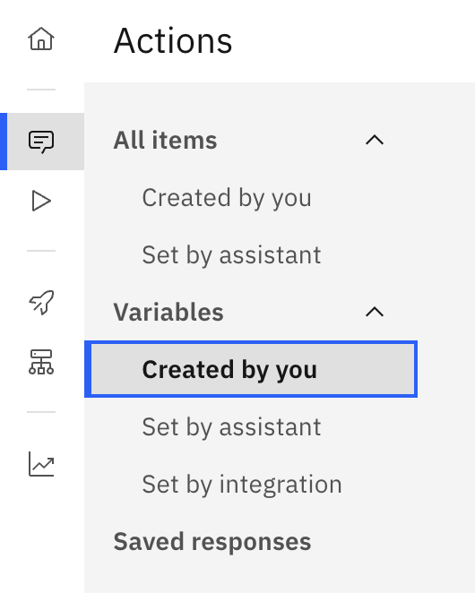
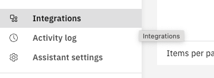
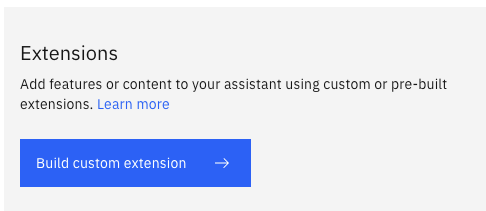
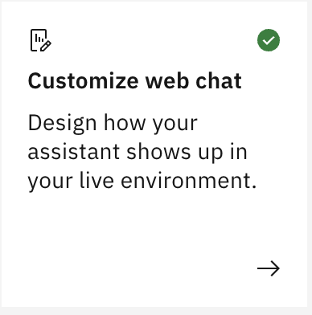

### Criar Conta IBM Cloud

- Cadastro `IBM Academic Initiative`

    [IBM Academic Initiative](https://github.com/academic-initiative/documentation/blob/main/academic-initiative/how-to/How-to-register-with-the-IBM-Academic-Initiative/readme.md)

- Obter promocode para a `IBM Cloud`

    [IBM Cloud Promocode](https://github.com/academic-initiative/documentation/blob/main/academic-initiative/how-to/How-to-request-and-IBM-Cloud-Feature-Code/readme.md)

- Ativar `IBM Cloud`

    [IBM Cloud](https://github.com/academic-initiative/documentation/blob/main/academic-initiative/how-to/How-to-create-an-IBM-Cloud-account/readme.md)

### Acesso IBM Console
- Acessar a url `https://cloud.ibm.com/`
- Obter uma chave de API `https://cloud.ibm.com/iam/apikeys`

## Text to Speech
- Utilizar como base o projeto `aula/voz`
- Criar um arquivo `.env`
```javascript
IBM_API_KEY=
IBM_URL=
PORT=3000
```
## MQ
- Instanciar o serviço de fila **IBM MQ**
- Criar um gerenciador de filas e abrir o console de gerenciamento
- Utilizar como base o projeto `aula/mq-pedidos`
- Criar um arquivo `.env`
```javascript
MQ_REST_URL=https://web-{qmgr-id}.qm.{region}.mq.appdomain.cloud/ibmmq/rest/v1

# Queue Manager name
MQ_QMGR=

# Queue name
MQ_QUEUE_NAME=

# User credentials (Basic Auth)
MQ_USER=
MQ_PASSWORD=
```
- Código para enviar um pedido para a fila MQ
```javascript
// Variáveis gerais para acesso à fila
const restUrl = process.env.MQ_REST_URL;
const qmgrName = process.env.MQ_QMGR;
const queueName = process.env.MQ_QUEUE_NAME;
const username = process.env.MQ_USER;
const password = process.env.MQ_PASSWORD;

const endpoint = `${restUrl}/messaging/qmgr/${qmgrName}/queue/${queueName}/message`;

const enviarMensagem = (message, res) => {

    // Configuração da requisição
    const config = {
        method: 'post',
        url: endpoint,
        auth: {
            username: username,
            password: password
        },
        headers: {
            'Content-Type': 'text/plain',
            'ibm-mq-rest-csrf-token': 'value' // Token CSRF obrigatório
        },
        data: message
    };

    // Enviar mensagem
    console.log('Enviando mensagem...\n');

    axios(config).then(response => {
        console.log('✓ Mensagem enviada com sucesso!');
        console.log('─────────────────────────────────────');
        console.log(`Status: ${response.status} ${response.statusText}`);
        console.log(`Conteúdo: "${message}"`);
        console.log(`Tamanho: ${message.length} bytes`);

        // Informações adicionais do response
        if (response.headers['ibm-mq-md-messageid']) {
            console.log(`Message ID: ${response.headers['ibm-mq-md-messageid']}`);
        }
        console.log('─────────────────────────────────────\n');

        res.json({
            sucesso: true,
            mensagem: "Pedido recebido com sucesso!",
            pedido: message
        });
    }).catch(error => {
        console.error('✗ Erro ao enviar mensagem:');

        if (error.response) {
            // Erro da API
            console.error(`Status: ${error.response.status}`);
            console.error(`Mensagem: ${error.response.statusText}`);

            if (error.response.data) {
                console.error('Detalhes:', error.response.data);
            }
        } else if (error.request) {
            // Erro de rede
            console.error('Erro de conexão. Verifique a URL e conectividade.');
            console.error('URL:', endpoint);
        } else {
            // Outro erro
            console.error('Erro:', error.message);
        }

        process.exit(1);
    });

}

const receberMensagem = (res) => {

    const config = {
        method: 'delete',
        url: endpoint,
        auth: {
            username: username,
            password: password
        },
        headers: {
            'ibm-mq-rest-csrf-token': 'value' // Token CSRF obrigatório
        },
        // Timeout de 30 segundos para esperar por mensagens
        timeout: 30000
    };

    console.log('Aguardando mensagem...');

    axios(config).then(response => {

        console.log(`\n✓ Mensagem Recebida`);
        console.log('─────────────────────────────────────');
        console.log(`Status: ${response.status} ${response.statusText}`);
        console.log(`Conteúdo: "${JSON.stringify(response.data, null, 2)}"`);

        // Informações adicionais dos headers
        if (response.headers['ibm-mq-md-messageid']) {
            console.log(`Message ID: ${response.headers['ibm-mq-md-messageid']}`);
        }
        if (response.headers['ibm-mq-md-correlationid']) {
            console.log(`Correlation ID: ${response.headers['ibm-mq-md-correlationid']}`);
        }
        if (response.headers['ibm-mq-md-format']) {
            console.log(`Format: ${response.headers['ibm-mq-md-format']}`);
        }
        if (response.headers['ibm-mq-md-putdate']) {
            console.log(`Put Date: ${response.headers['ibm-mq-md-putdate']}`);
        }
        if (response.headers['ibm-mq-md-puttime']) {
            console.log(`Put Time: ${response.headers['ibm-mq-md-puttime']}`);
        }

        console.log('─────────────────────────────────────\n');

        res.json(response.data);

    }).catch(error => {
        if (error.response) {
            if (error.response.status === 404) {
                console.log(`ℹ Nenhuma mensagem disponível na fila\n`);
                return false;
            } else {
                console.error(`✗ Erro ao receber mensagem:`);
                console.error(`Status: ${error.response.status}`);
                console.error(`Mensagem: ${error.response.statusText}`);

                if (error.response.data) {
                    console.error('Detalhes:', error.response.data);
                }
            }
        } else if (error.code === 'ECONNABORTED') {
            console.log(`ℹ Timeout - Nenhuma mensagem recebida no período\n`);
            return false;
        } else if (error.request) {
            console.error(`✗ Erro de conexão. Verifique a URL e conectividade.`);
            console.error('URL:', endpoint);
            return false;
        } else {
            console.error(`✗ Erro:`, error.message);
            return false;
        }
    });
}

```

# Cloudant

- Banco de dados **NoSQL baseado em documentos**, criado a partir do **Apache CouchDB**.
- Referência da API: https://cloud.ibm.com/apidocs/cloudant
- Instalar o SDK para **Node.js**:

```bash
npm install @ibm-cloud/cloudant ibm-cloud-sdk-core
```

---

## Efetuar a conexão

Substitua `{apikey}` e `{url}` pelos valores do seu serviço Cloudant.

```javascript
const { CloudantV1 } = require("@ibm-cloud/cloudant");
const { IamAuthenticator } = require("ibm-cloud-sdk-core");

const cloudant = CloudantV1.newInstance({
    authenticator: new IamAuthenticator({
        apikey: "{apikey}"
    }),
    serviceUrl: "{url}"
});
```

---

## Obter informações do servidor (validar conexão)

```javascript
async function validarConexao() {

    try {

        const response = await cloudant.getServerInformation();

        console.log(response.result);

    } catch (err) {

        console.error(err);

    }

}

validarConexao();
```

---

## Listar bancos

```javascript
const response = await cloudant.getAllDbs();

console.log(response.result);
```

---

## Criar um banco

```javascript
const response = await cloudant.putDatabase({
    db: "alunos",
    partitioned: false
});

console.log(response.result);
```

---

## Obter informações de um banco

```javascript
const response = await cloudant.getDatabaseInformation({
    db: "alunos"
});

console.log(response.result);
```

---

## Inserir um documento

```javascript
const aluno = {
    _id: "RM1002",
    nome: "Mariana Alves",
    curso: "Ciência da Computação",
    creditos: 75
};

const response = await cloudant.postDocument({
    db: "alunos",
    document: aluno
});

console.log(response.result);
```

---

## Verificar se o banco existe

```javascript
const response = await cloudant.headDatabase({
    db: "alunos"
});

console.log(response.status);
```

---

# Obter o arquivo de alunos

Linux / macOS

```bash
wget https://github.com/esensato/icl-2026-01/raw/refs/heads/main/alunos.json
```

Windows (PowerShell)

```powershell
Invoke-WebRequest `
-Uri "https://github.com/esensato/icl-2026-01/raw/refs/heads/main/alunos.json" `
-OutFile "alunos.json"
```

---

# Efetuar carga de documentos em lote

```javascript
const fs = require("fs");

const alunos = JSON.parse(
    fs.readFileSync("alunos.json", "utf8")
);

const response = await cloudant.postBulkDocs({
    db: "alunos",
    bulkDocs: alunos
});

console.log(response.result);
```

---

# Pesquisar um documento específico

```javascript
const response = await cloudant.getDocument({
    db: "alunos",
    docId: "RM1002"
});

console.log(response.result);
```

---

# Atualizar um documento

Para atualizar um documento é necessário informar seu **_rev** (revisão atual).

Primeiro obtenha o documento:

```javascript
const documento = await cloudant.getDocument({
    db: "alunos",
    docId: "RM1002"
});

const aluno = documento.result;
```

Altere os dados desejados:

```javascript
aluno.creditos = 90;
```

Atualize o documento:

```javascript
const response = await cloudant.putDocument({
    db: "alunos",
    docId: aluno._id,
    document: aluno
});

console.log(response.result);
```

---

# Excluir um documento

Também é necessário informar a revisão (**_rev**).

```javascript
const documento = await cloudant.getDocument({
    db: "alunos",
    docId: "RM1002"
});

await cloudant.deleteDocument({
    db: "alunos",
    docId: "RM1002",
    rev: documento.result._rev
});

console.log("Documento removido.");
```

---

# Excluir um banco de dados

```javascript
const response = await cloudant.deleteDatabase({
    db: "alunos"
});

console.log(response.result);
```

---

# Obter o token de acesso

```bash
curl -X POST "https://iam.cloud.ibm.com/identity/token" \
-H "Content-Type: application/x-www-form-urlencoded" \
-d "grant_type=urn:ibm:params:oauth:grant-type:apikey&apikey={chave_api_cloudant}"
```

---

# Exemplo completo

```javascript
const { CloudantV1 } = require("@ibm-cloud/cloudant");
const { IamAuthenticator } = require("ibm-cloud-sdk-core");
const fs = require("fs");

async function main() {

    const cloudant = CloudantV1.newInstance({
        authenticator: new IamAuthenticator({
            apikey: "{apikey}"
        }),
        serviceUrl: "{url}"
    });

    try {

        // Validação da conexão
        console.log("Servidor:");
        console.log((await cloudant.getServerInformation()).result);

        // Lista os bancos existentes
        console.log("\nBancos:");
        console.log((await cloudant.getAllDbs()).result);

        // Cria o banco
        await cloudant.putDatabase({
            db: "alunos",
            partitioned: false
        });

        // Insere um documento
        await cloudant.postDocument({
            db: "alunos",
            document: {
                _id: "RM1002",
                nome: "Mariana Alves",
                curso: "Ciência da Computação",
                creditos: 75
            }
        });

        // Consulta o documento
        const aluno = await cloudant.getDocument({
            db: "alunos",
            docId: "RM1002"
        });

        console.log("\nAluno encontrado:");
        console.log(aluno.result);

    } catch (err) {

        console.error(err);

    }

}

main();
```

### Observações

- Todas as operações do SDK utilizam **Promises**, sendo recomendado o uso de `async/await`.
- A atualização e exclusão de documentos exigem informar o campo **_rev**, que representa a revisão atual do documento.
- Os documentos são armazenados em formato **JSON**, característica típica dos bancos NoSQL orientados a documentos como o Cloudant e o CouchDB.

### Ferramenta CLI (ibmcloud)
- Efetuar o download e instalação [ibmcloud](https://cloud.ibm.com/docs/cli?topic=cli-install-ibmcloud-cli)
- Para testar e listar os *plug-ins*
```bash
ibmcloud --version
ibmcloud plugin list
```
- Verificar a chave de API `https://cloud.ibm.com/iam/apikeys`
- Efetuar o login na **IBM Cloud**, listar os grupos de recursos e selecionar um grupo (*Default*)
```bash
ibmcloud login --apikey IBMCLOUD_API_KEY
ibmcloud resource groups
ibmcloud target -g 
```
- Listar os recursos instanciados
```bash
ibmcloud resource service-instances
```
- Para remover um recurso
```bash
ibmcloud resource service-instance-delete NOME_OU_ID
```
- Criar uma instância de serviço (por exemplo, **continuous-delivery**) chamada **cicd** com plano **lite** na região **br-sao**
```ba
ibmcloud resource service-instance-create cicd continuous-delivery lite br-sao
```
- Definindo a região atual
```bash
ibmcloud target -r br-sao
```
- Visualizando a cadeia de ferramentas
```bash
ibmcloud dev toolchains
```
### Container Registry
```bash
ibmcloud plugin install container-registry

ibmcloud cr region-set br-sao

ibmcloud cr namespace-list

ibmcloud cr namespace-add meu-namespace

ibmcloud cr images
```
- Para remover um **namespace**
```bash
ibmcloud cr namespace-rm meu-namespace -f
```
- Depois de criar o **toolchain** e publicar a imagem com o **tekton**
```bash
ibmcloud cr login --client docker

docker pull IMAGEM...

docker run -it ...
```

### Deploy de Aplicações
- Criar uma instância de **Continuous Delivery**
- Criar uma **Toolchain (Cadeia de Ferramentas)**
- Hierarquia **Tekton**
    - EventListener -> TriggerBinding -> TriggerTemplate -> Pipeline -> Task
### Watson Assistant
- Permite a criação de **chatbots**
- Efetuar login na [IBM Cloud](https://cloud.ibm.com)
- Instanciar o serviço [Watson Assistant](https://cloud.ibm.com/catalog/services/watsonx-assistant)
- Considerar o seguinte caso de uso:
    - Crie um assistente que auxilie alunos a faculdade "Belo Diploma" a prestar informações de forma automatizada ao seu público alvo, constituído por:
        - Alunos: uso do assistente para tarefas mais objetivas como verificar disciplicas matriculadas, notas, créditos concluídos, etc...
        - Ex-alunos: interessados em saber quais são as novidades da faculdade, suas linhas de pesquisa para eventuais cursos de extensão
        - Interessados nos cursos: alunos em potencial que desejam maiores detalhes sobre a instituição e seus cursos 
    - O assistente deve prever integração com o sistema *back-end* da universidade para prestar as informações solicitadas (quando aplicado)
- Criar o diálogo introdutório, o `On boarding`
    - Actions -> Set by assistant -> Greet customer
- Adicionar 3 variações de resposta para quando a pergunta não for compreendida pelo Chatbot (escolhidas aleatoriamente)
    - Actions -> Set by assistant -> No matches
- Criar uma ação personalizada para saber o nome do aluno
- Criar variáveis de sessão:

<div style="width:50px">

</div>

#### Integração com o sistema da universidade
- Realizar a integração com a base de dados **Cloudant**
  
<div style="width:50px;">

</div>

- Criar uma integração personalizada

<div style="width:100px; height:100px">

</div>

- Formato [OpenAPI](https://editor.swagger.io/) 
```json
{
  "openapi": "3.0.3",
  "info": {
    "title": "Cloudant Alunos API",
    "description": "API para consulta de documentos na base alunos do IBM Cloudant",
    "version": "1.0.0"
  },
  "servers": [
    {
      "url": "https://~replace-with-cloudant-host~.cloudantnosqldb.appdomain.cloud"
    }
  ],
  "paths": {
    "/alunos/_id:{id}": {
      "get": {
        "summary": "Buscar aluno por ID",
        "description": "Retorna um documento da base alunos a partir do _id.",
        "parameters": [
          {
            "name": "id",
            "in": "path",
            "required": true,
            "description": "Identificador do aluno",
            "schema": {
              "type": "string",
              "example": "1000042"
            }
          }
        ],
        "responses": {
          "200": {
            "description": "Documento encontrado",
            "content": {
              "application/json": {
                "schema": {
                  "type": "object",
                  "additionalProperties": true
                }
              }
            }
          },
          "401": {
            "description": "Não autorizado"
          },
          "404": {
            "description": "Documento não encontrado"
          }
        },
        "security": [
          {
            "bearerAuth": []
          }
        ]
      }
    }
  },
  "components": {
    "securitySchemes": {
      "bearerAuth": {
        "type": "http",
        "scheme": "bearer",
        "bearerFormat": "JWT"
      }
    }
  }
}
```
#### Exercícios
- Implementar novos diálogos:
    - Permitir que o aluno consulte os seus créditos
    - Permitir que o aluno deixe algum recado escrito (dúvidas, críticas, elogios, sugestões, etc...) para a secretaria

### Personalizando o chatbot
- Instalar em uma página HTML

    [Instalar Assistente](https://developer.ibm.com/tutorials/embed-watson-assistant-in-website/)

- Código inicial para exibir o chatbot em um site
    ```javascript
    <script>
      window.watsonAssistantChatOptions = {
        // A UUID like '1d7e34d5-3952-4b86-90eb-7c7232b9b540' included in the embed code provided in IBM watsonx Assistant.
        integrationID: 'YOUR_INTEGRATION_ID',
        // Your assistants region e.g. 'us-south', 'us-east', 'jp-tok' 'au-syd', 'eu-gb', 'eu-de', etc.
        region: 'YOUR_REGION',
        // A UUID like '6435434b-b3e1-4f70-8eff-7149d43d938b' included in the embed code provided in IBM watsonx Assistant.
        serviceInstanceID: 'YOUR_SERVICE_INSTANCE_ID',
        // The callback function that is called after the widget instance has been created.
        onLoad: async (instance) => {
          await instance.render();
        }
      };
      setTimeout(function(){const t=document.createElement('script');t.src='https://web-chat.global.assistant.watson.appdomain.cloud/versions/' + (window.watsonAssistantChatOptions.clientVersion || 'latest') + '/WatsonAssistantChatEntry.js';document.head.appendChild(t);});
    </script>
    ```
- Para obter um exemplo, clicar em
    <div style="width:100px; height:100px">
    
    </div>

- E em seguida, clicar na aba superior **Embed**
- `onLoad` executado quando o chatbot é carregado
- Configurações de *layout*
    ```json
        layout: {
            showFrame: true,
            hasContentMaxWidth: false,
        }
    ```
- Configurações do tema
    ```json
        themeConfig: {
            carbonTheme: 'g100',
            corners: 'round',
        }
    ```
- Obs: `carbonTheme` podem ser "white", "g10", "g90" ou "g100" e `corner` "square" ou "round"
- Botão para fechar o chatbot
    ```json
        headerConfig: {
            closeButtonIconType: 'side-panel-left',
        }
    ```
- Obs: opções "minimize", "close", "side-panel-left" e "side-panel-right".
#### Eventos
- Lista de eventos completa pode ser encontrada [Aqui](https://web-chat.global.assistant.watson.cloud.ibm.com/docs.html?to=api-events#event-list)
    ```javascript
        instance.on({
            type: 'receive', handler: (event) => { console.log('I received a message!', event); }
        });
    ```
- Evento `receive`: executado quando uma mensagem é recebida;
- - Os principais parâmetros recebidos pelas funçõs na varável `event` são:
    - `event.data`: mensagem (dados) recebidos pelo chatbot como respostas das intenções do usuário;
    - `event.data.output.generic`: itens da resposta recebidos (texto, etc...)
- Evento `pre:receive`: executado antes do `receive`;
    ```javascript
        instance.on({
            type: 'pre:receive', handler: (event) => {
                console.log('pre:receive')
                const message = event.data;
                if (message.output.generic) {
                    message.output.generic.forEach(messageItem => {
                        console.log(messageItem);
                        if (messageItem.response_type === 'text') {
                            messageItem.response_type = 'teste123';
                        }
                    })
                }
            }
        });
    ```

- Evento `customResponse`: permite criar uma resposta personalizada;
    ```javascript
        function customResponseHandler(event) {
            const { message, element, fullMessage } = event.data;

            const div = document.createElement('div');
            // obtem o texto da mensagem
            div.innerHTML = message.text;
            div.style.border = 'solid 1px';
            div.style.color = 'red';

            // message.options.forEach((messageItem, index) => {
            //     const button = document.createElement('button');
            //     button.innerHTML = messageItem.label;
            //     button.classList.add('CardButton');
            //     button.addEventListener('click', () => onClick(messageItem, button, fullMessage, index));
            //     element.appendChild(button);
            // });

            element.appendChild(div);

        }
    ```
### Conectar DB2
- Para referência à API clicar [aqui](https://cloud.ibm.com/apidocs/db2-on-cloud/db2-on-cloud-v4)
- Definir as variáveis para a obter o token de conexão
```python
url = ""
userid = ""
password = ""
deployment_id = ""
```
- Obter o token (exemplo em *python*)
```python
import http.client
import ssl
import json

context = ssl._create_unverified_context()

conn = http.client.HTTPSConnection(url, context=context)

payload = {"userid":userid,"password":password}

headers = {
    'content-type': "application/json",
    'x-deployment-id': deployment_id
    }

conn.request("POST", "/dbapi/v4/auth/tokens", json.dumps(payload), headers)

res = conn.getresponse()
data = res.read()

print(json.loads(data.decode("utf-8"))["token"])
```
- Criar as seguintes variáveis de sessão:
    - `DB2_DEPLOYMENT_ID`
    - `DB2_USERNAME`
    - `DB2_PASSWORD`
    - `DB2_TOKEN`: inicialmente vazia pois irá armazenar o *token* gerado para acesso ao banco de dados
- Obter o token por meio da especificação *OpenAPI* abaixo
- Trocar `"url": "https://{HOSTNAME}"` pelo *hostname* fornecido nas credencias do DB2 criado na cloud
- O `HOSTNAME` deve ser obtido do parâmetro **Nome do host da API de REST** que fica na guia **Conexões** dentro do banco de dados Db2 criado na **IBM Cloud**
```json
{
  "openapi": "3.0.3",
  "info": {
    "title": "DB API Authentication",
    "version": "1.0.0",
    "description": "Endpoint para autenticação e geração de token."
  },
  "servers": [
        {
            "url": "https://{HOSTNAME}",
            "variables": {
                "HOSTNAME": {
                    "default": "example.db2.cloud.ibm.com"
                }
            }
        }
  ],
  "paths": {
    "/dbapi/v4/auth/tokens": {
      "post": {
        "summary": "Generate authentication token",
        "operationId": "generateAuthToken",
        "parameters": [
          {
            "name": "x-deployment-id",
            "in": "header",
            "required": true,
            "schema": {
              "type": "string"
            },
            "description": "Deployment identifier"
          }
        ],
        "requestBody": {
          "required": true,
          "content": {
            "application/json": {
              "schema": {
                "type": "object",
                "required": [
                  "userid",
                  "password",
                  "separator",
                  "stop_on_error"
                ],
                "properties": {
                  "userid": {
                    "type": "string",
                    "example": "user123"
                  },
                  "password": {
                    "type": "string",
                    "example": "mypassword"
                  },
                  "separator": {
                    "type": "string",
                    "enum": [";"]
                  },
                  "stop_on_error": {
                    "type": "string",
                    "enum": ["no"]
                  }
                }
              }
            }
          }
        },
        "responses": {
          "200": {
            "description": "Authentication token generated",
            "content": {
              "application/json": {
                "schema": {
                  "type": "object",
                  "properties": {
                    "userid": {
                      "type": "string",
                      "example": "user123"
                    },
                    "token": {
                      "type": "string",
                      "example": "eyJhbGciOiJIUzI1NiIsInR5cCI6IkpXVCJ9..."
                    }
                  }
                }
              }
            }
          }
        }
      }
    }
  }
}
```
- Armazenar o *token* em uma variável
- Efetuar uma consulta *SQL* ao banco de dados e obter o `id` da execução (assíncrona)
```python
import http.client
import ssl
import json

context = ssl._create_unverified_context()

conn = http.client.HTTPSConnection(url, context=context)

payload = {"commands":"select * from disciplinas", "separator":";","stop_on_error":"no"}

headers = {
    'content-type': "application/json",
    'authorization': f"Bearer {token}",
     'x-deployment-id': deployment_id
}

conn.request("POST", "/dbapi/v4/sql_jobs", json.dumps(payload), headers)

res = conn.getresponse()
data = res.read()

print(json.loads(data.decode("utf-8"))["id"])
```
- Exemplo especificação *OpenAPI*
```json
{
    "openapi": "3.0.3",
    "info": {
        "title": "Db2 SQL Jobs API",
        "version": "1.0.0",
        "description": "API para submissão de comandos SQL assíncronos no Db2 on Cloud."
    },
    "servers": [
        {
            "url": "https://{HOSTNAME}",
            "variables": {
                "HOSTNAME": {
                    "default": "example.db2.cloud.ibm.com"
                }
            }
        }
    ],
    "paths": {
        "/dbapi/v4/sql_jobs": {
            "post": {
                "summary": "Submeter Job SQL",
                "operationId": "submitSqlJob",
                "parameters": [
                    {
                        "name": "Authorization",
                        "in": "header",
                        "required": true,
                        "description": "Token Bearer de autenticação.",
                        "schema": {
                            "type": "string",
                            "example": "Bearer eyJhbGciOiJIUzI1NiIsInR5cCI6IkpXVCJ9..."
                        }
                    },
                    {
                        "name": "x-deployment-id",
                        "in": "header",
                        "required": true,
                        "description": "Identificador do deployment do serviço.",
                        "schema": {
                            "type": "string",
                            "example": "zzz"
                        }
                    }
                ],
                "requestBody": {
                    "required": true,
                    "content": {
                        "application/json": {
                            "schema": {
                                "type": "object",
                                "required": [
                                    "commands"
                                ],
                                "properties": {
                                    "commands": {
                                        "type": "string",
                                        "example": "select * FROM DISCIPLINAS"
                                    },
                                    "limit": {
                                        "type": "integer",
                                        "enum": [10]
                                    },
                                    "separator": {
                                        "type": "string",
                                        "enum": [";"]
                                    },
                                    "stop_on_error": {
                                        "type": "string",
                                        "enum": [
                                            "no"
                                        ]
                                    }
                                }
                            }
                        }
                    }
                },
                "responses": {
                    "200": {
                        "description": "Job criado com sucesso",
                        "content": {
                            "application/json": {
                                "schema": {
                                    "type": "object",
                                    "properties": {
                                        "id": {
                                            "type": "string",
                                            "example": "1234567890abcdef"
                                        }
                                    }
                                }
                            }
                        }
                    },
                    "400": {
                        "description": "Requisição inválida"
                    },
                    "401": {
                        "description": "Não autorizado"
                    }
                }
            }
        }
    }
}
```
- Uma forma de definir a formação para o resultado da consulta é usando o `STRAGGR`
```sql
SELECT 
LISTAGG(
    '<div style="background-color: #f0f0f0;font-weight: bold;">' || id || '</div>' ||
    '<div>' || nome_disciplina || '</div>' ||
    '<div>Semestre: ' || semestre || '</div>' ||
    '<div>Créditos: ' || creditos || '</div>'
,'') 
WITHIN GROUP (ORDER BY id) AS html
FROM DISCIPLINAS WHERE SEMESTRE = ${SEMESTRE}
```
- Obter o restulado final da execução (atualizar o `id`)
```bash
import http.client
import ssl
import json

context = ssl._create_unverified_context()

conn = http.client.HTTPSConnection(url, context=context)

headers = {
    'content-type': "application/json",
    'authorization': f"Bearer {token}",
     'x-deployment-id': deployment_id
}

conn.request("GET", f"/dbapi/v4/sql_jobs/1772644599186_733471460", headers=headers)

res = conn.getresponse()
data = res.read()

print(data.decode("utf-8"))
```
```json
{
    "openapi": "3.0.3",
    "info": {
        "title": "Db2 SQL Job Result API",
        "version": "1.0.0",
        "description": "API para consultar o resultado de um SQL Job no Db2 on Cloud."
    },
    "servers": [
        {
            "url": "https://${HOSTNAME}",
            "variables": {
                "HOSTNAME": {
                    "default": "example.db2.cloud.ibm.com"
                }
            }
        }
    ],
    "paths": {
        "/dbapi/v4/sql_jobs/{id}": {
            "get": {
                "summary": "Consultar resultado do SQL Job",
                "operationId": "getSqlJobResult",
                "parameters": [
                    {
                        "name": "id",
                        "in": "path",
                        "required": true,
                        "description": "Identificador do job SQL.",
                        "schema": {
                            "type": "string",
                            "example": "1772644599186_733471460"
                        }
                    },
                    {
                        "name": "Authorization",
                        "in": "header",
                        "required": true,
                        "description": "Token Bearer de autenticação.",
                        "schema": {
                            "type": "string",
                            "example": "Bearer eyJhbGciOiJIUzI1NiIsInR5cCI6IkpXVCJ9..."
                        }
                    },
                    {
                        "name": "x-deployment-id",
                        "in": "header",
                        "required": true,
                        "description": "Identificador do deployment do serviço.",
                        "schema": {
                            "type": "string",
                            "example": "zzz"
                        }
                    }
                ],
                "responses": {
                    "200": {
                        "description": "Resultado do SQL Job",
                        "content": {
                            "application/json": {
                                "schema": {
                                    "type": "object",
                                    "properties": {
                                        "id": {
                                            "type": "string"
                                        },
                                        "status": {
                                            "type": "string",
                                            "example": "completed"
                                        },
                                        "results": {
                                            "type": "array",
                                            "items": {
                                                "type": "object",
                                                "properties": {
                                                    "rows_count": {
                                                        "type": "integer",
                                                        "description": "Quantidade de linhas retornadas.",
                                                        "example": 32
                                                    },
                                                    "rows": {
                                                        "type": "array",
                                                        "description": "Matriz contendo os resultados da consulta.",
                                                        "items": {
                                                            "type": "array",
                                                            "items": {
                                                                "type": "string"
                                                            }
                                                        }
                                                    }
                                                }
                                            }
                                        }
                                    }
                                }
                            }
                        }
                    },
                    "400": {
                        "description": "Requisição inválida"
                    },
                    "401": {
                        "description": "Não autorizado"
                    },
                    "404": {
                        "description": "Job não encontrado"
                    }
                }
            }
        }
    }
}
```
